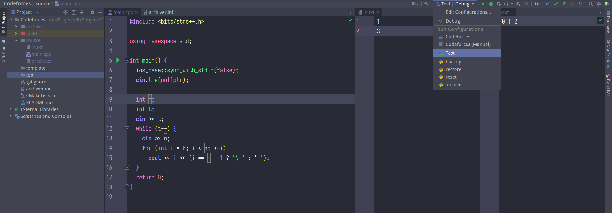

# Monorepo for programming exercises

## Usage



### Coding

Code under `source` directory.

Test your code against the test case (`in.txt` and `oracle.txt`) with CTest:

```
ctest --output-on-failure
```

or, use `tool/tester.py` directly:

```
./tool/tester.py <executable> <input file> <oracle file>
```

or, directly use the executable produced by CMake, e.g. like this:

```shell
./build/Codeforces < ./source/in.txt
```

### Managing

Manage your code with this directory structure:

- `source`: current working code
- `template`: template code
- `archive`: history code

And use `tool/archiver.py` to automate operations:

```shell
# To backup `source` to `archive`:
./tool/archiver.py backup

# To restore from some directory under `archive`:
./tool/archiver.py restore

# To reset `source` with `template`
./tool/archiver.py reset

# To backup `source` to `archive` and then reset `source` with `template`
./tool/archiver.py archive
```

Note: use `archiver.ini` or command line arguments to specify paths.

## Example

Here is the process of a typical use case:

1. Set `archive=archive/Codeforces/E136` in `archive.ini`
2. For each problem `P` in {A, B, C, D}:
    1. Copy sample input and output to `source/in.txt` and `source/oracle.txt`
    2. Solve the problem in `source/main.cpp`
    3. Archive `source` to a subdirectory under `archive/Codeforces/E136/` by `./tool/archiver.py archive`
       (the tool will interactively ask for the problem ID, and use it to name the subdirectory)